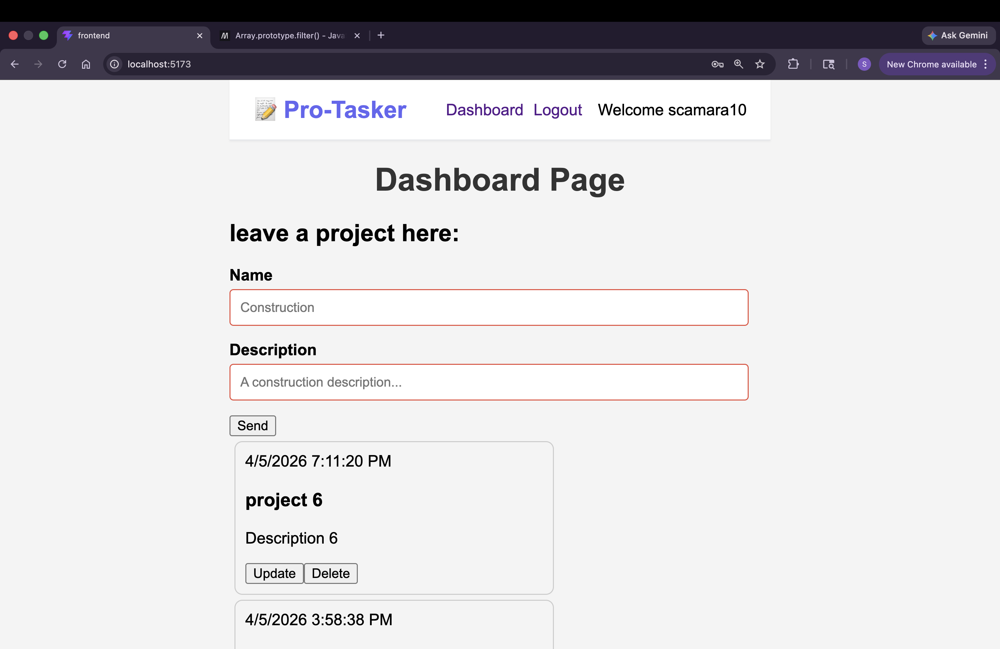
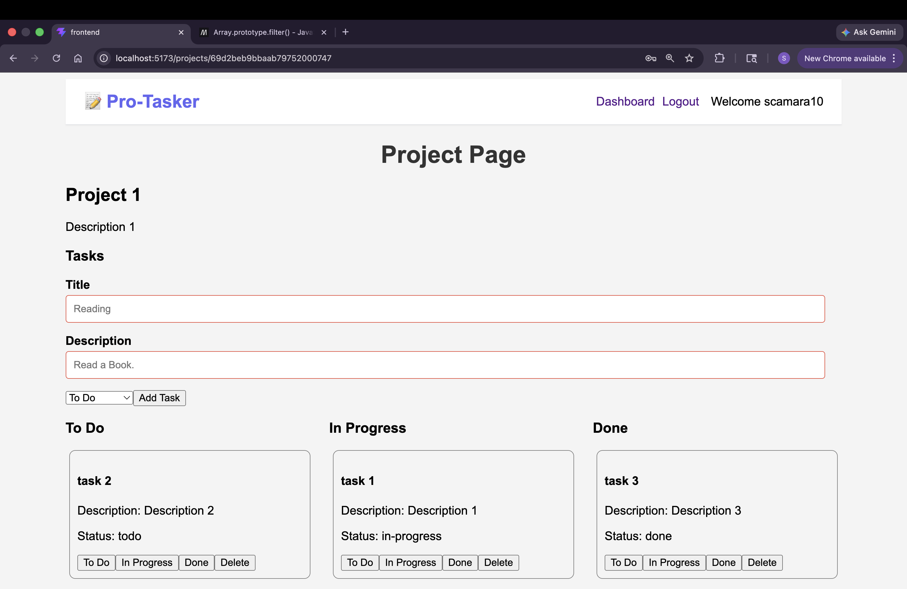
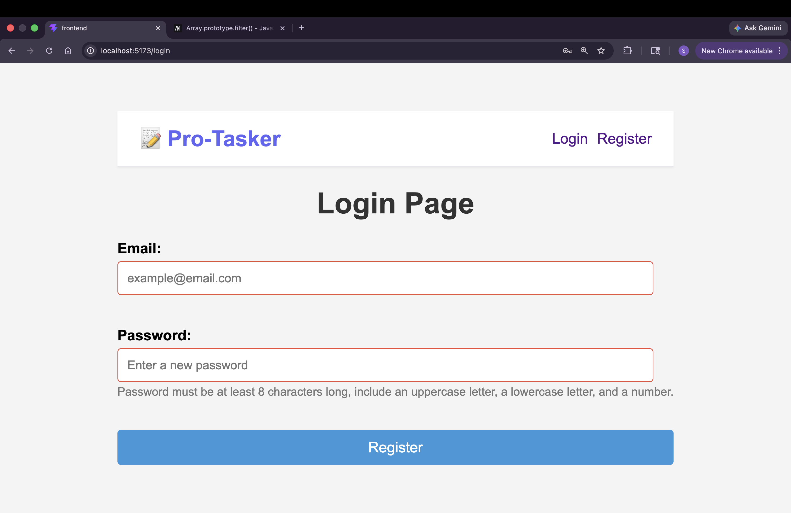
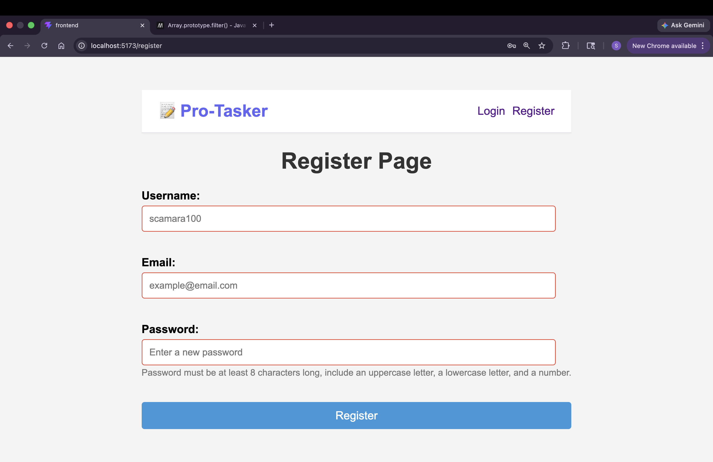

**🚀 Pro-Tasker App**
*📌 Description*

Pro-Tasker is a full-stack project management application that allows users to create, manage, and track projects and tasks efficiently.

Users can:

Register and log in securely using JWT authentication
Create, update, and delete projects
Manage tasks within each project
Organize tasks by status (To Do, In Progress, Done)

This app demonstrates full-stack development using modern technologies including React, Node.js, Express, and MongoDB.

**🛠️ Tech Stack**
Frontend
React (Vite)
React Router
Axios
Context API (Authentication)
Backend
Node.js
Express.js
MongoDB (Mongoose)
JWT Authentication
**⚙️ Setup & Installation**
*1. Clone the repository*
git clone https://github.com/your-username/pro-tasker.git
cd pro-tasker
*2. Backend Setup*
cd backend
npm install

Create a .env file in the backend folder:

PORT=8080
MONGO_URI=your_mongodb_connection_string
JWT_SECRET=your_secret_key

Run the backend server:

npm run dev
*3. Frontend Setup*
cd ../frontend
npm install

Run the frontend:

npm run dev
*4. Open the App*

Visit:

http://localhost:5173
**🔐 Authentication**

This app uses JWT-based authentication:

Token is stored in localStorage
Sent in headers for protected routes:
Authorization: Bearer <token>
**📡 API Endpoints**
👤 User Routes (/api/users)
Method	Endpoint	Description
POST	/register	Register a new user
POST	/login	Login user and return JWT
GET	/	Get current authenticated user
**📁 Project Routes (/api/projects)**
Method	Endpoint	Description
GET	/	Get all projects for logged-in user
POST	/	Create a new project
GET	/:id	Get a single project with tasks
PUT	/:id	Update a project
DELETE	/:id	Delete a project
*✅ Task Routes (/api/projects/:projectId/tasks)*
Method	Endpoint	Description
POST	/	Create a new task in a project
PUT	/:taskId	Update a task
DELETE	/:taskId	Delete a task
**🧠 Features**
🔐 Secure authentication with JWT
📁 Project management (CRUD)
✅ Task management within projects
📊 Task status organization (Kanban-style)
⚡ Fast and responsive UI
**🚧 Future Improvements**
Drag-and-drop task board (like Trello)
Task due dates and priorities
User collaboration (shared projects)
Notifications system
👨‍💻 Author

Sekouba CAMARA

📄 License

This project is open-source and available under the MIT License.

